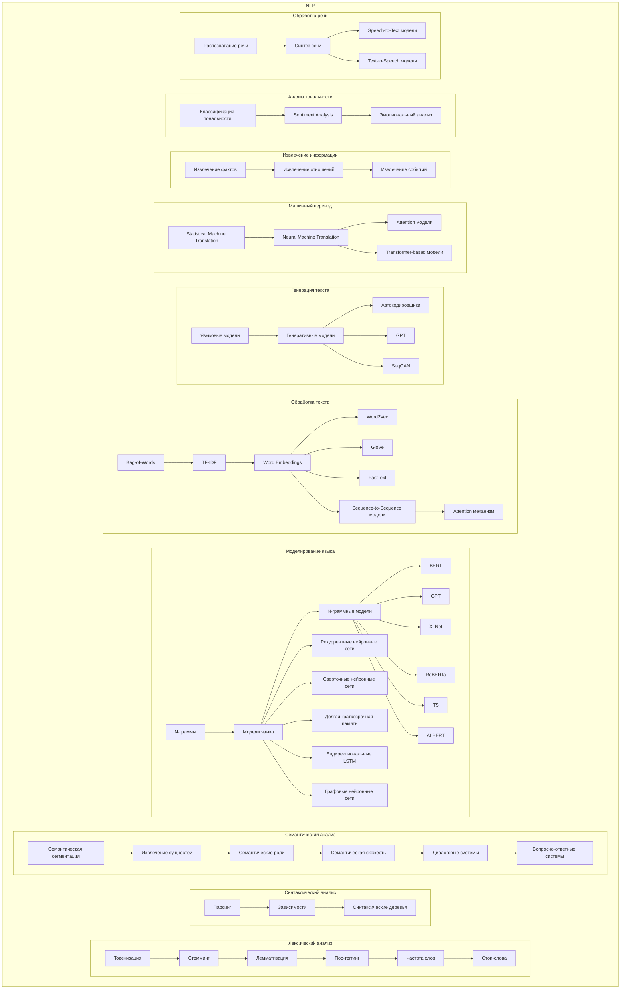
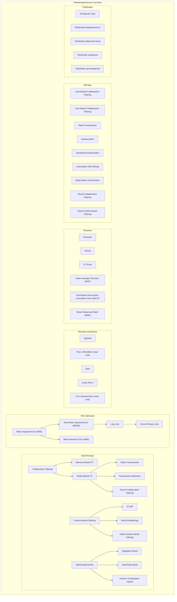

```mermaid
graph TB;
subgraph "NLP"
    subgraph "Лексический анализ"
    direction LR
        A[Токенизация] --> B[Стемминг]
        B --> C[Лемматизация]
        C --> D[Пос-теггинг]
        D --> E[Частота слов]
        E --> F[Стоп-слова]
    end

    subgraph "Синтаксический анализ"
    direction LR
        G[Парсинг] --> H[Зависимости]
        H --> I[Синтаксические деревья]
    end

    subgraph "Семантический анализ"
    direction LR
        J[Семантическая сегментация] --> K[Извлечение сущностей]
        K --> L[Семантические роли]
        L --> M[Семантическая схожесть]
        M --> N[Диалоговые системы]
        N --> O[Вопросно-ответные системы]
    end

    subgraph "Моделирование языка"
    direction LR
        P[N-граммы] --> Q[Модели языка]
        Q --> R[N-граммные модели]
        Q --> S[Рекуррентные нейронные сети]
        Q --> T[Сверточные нейронные сети]
        Q --> U[Долгая краткосрочная память]
        Q --> V[Бидирекциональные LSTM]
        Q --> W[Графовые нейронные сети]
        R --> X[BERT]
        R --> Y[GPT]
        R --> Z[XLNet]
        R --> AA[RoBERTa]
        R --> AB[T5]
        R --> AC[ALBERT]
    end

    subgraph "Обработка текста"
    direction LR
        AD[Bag-of-Words] --> AE[TF-IDF]
        AE --> AF[Word Embeddings]
        AF --> AG[Word2Vec]
        AF --> AH[GloVe]
        AF --> AI[FastText]
        AF --> AJ[Sequence-to-Sequence модели]
        AJ --> AK[Attention механизм]
    end

    subgraph "Генерация текста"
    direction LR
        AL[Языковые модели] --> AM[Генеративные модели]
        AM --> AN[Автокодировщики]
        AM --> AO[GPT]
        AM --> AP[SeqGAN]
    end

    subgraph "Машинный перевод"
    direction LR
        AQ[Statistical Machine Translation] --> AR[Neural Machine Translation]
        AR --> AS[Attention модели]
        AR --> AT[Transformer-based модели]
    end

    subgraph "Извлечение информации"
    direction LR
        AU[Извлечение фактов] --> AV[Извлечение отношений]
        AV --> AW[Извлечение событий]
    end

    subgraph "Анализ тональности"
    direction LR
        AX[Классификация тональности] --> AY[Sentiment Analysis]
        AY --> AZ[Эмоциональный анализ]
    end

    subgraph "Обработка речи"
    direction LR
        BA[Распознавание речи] --> BB[Синтез речи]
        BB --> BC[Speech-to-Text модели]
        BB --> BD[Text-to-Speech модели]
    end
end
```

```mermaid
graph TB;
    subgraph "Рекомендательные системы"
        direction LR;
        subgraph "Архитектуры"
        direction LR;
            A["Collaborative Filtering"] --> B["Memory-Based CF"];
            A --> C["Model-Based CF"];
            C --> D["Matrix Factorization"];
            C --> E["Factorization Machines"];
            C --> F["Neural Collaborative Filtering"];
            G["Content-based Filtering"] --> H["TF-IDF"];
            G --> I["Word Embeddings"];
            G --> J["Deep Content-based Filtering"];
            K["Hybrid Approaches"] --> L["Weighted Hybrid"];
            K --> M["Switching Hybrid"];
            K --> N["Feature Combination Hybrid"];
        end
        subgraph "Лосс функции"
        direction LR;
            O["Mean Squared Error (MSE)"] --> P["Root Mean Squared Error (RMSE)"];
            O --> Q["Mean Absolute Error (MAE)"];
            P --> R["Log Loss"];
            R --> S["Cross-Entropy Loss"];
        end
        subgraph "Функции активации"
        direction LR;
            T["Sigmoid"];
            U["ReLU (Rectified Linear Unit)"];
            V["Tanh"];
            W["Leaky ReLU"];
            X["ELU (Exponential Linear Unit)"];
        end
        subgraph "Метрики"
        direction LR;
            Y["Precision"];
            Z["Recall"];
            AA["F1 Score"];
            AB["Mean Average Precision (MAP)"];
            AC["Normalized Discounted Cumulative Gain (NDCG)"];
            AD["Mean Reciprocal Rank (MRR)"];
        end
        subgraph "Методы"
        direction LR;
            AE["User-Based Collaborative Filtering"];
            AF["Item-Based Collaborative Filtering"];
            AG["Matrix Factorization"];
            AH["Autoencoders"];
            AI["Variational Autoencoders"];
            AJ["Association Rule Mining"];
            AK["Deep Matrix Factorization"];
            AL["Neural Collaborative Filtering"];
            AM["Deep Content-based Filtering"];
        end
        subgraph "Проблемы"
        direction LR;
            AN["Холодный старт"];
            AO["Проблема разреженности"];
            AP["Проблема обратной связи"];
            AQ["Проблема смещения"];
            AR["Проблема противоречий"];
        end
    end


```
	