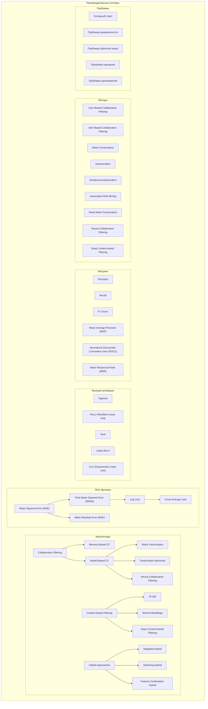

```mermaid
graph TB;
    subgraph "Рекомендательные системы"
        direction LR;
        subgraph "Архитектуры"
        direction LR;
            A["Collaborative Filtering"] --> B["Memory-Based CF"];
            A --> C["Model-Based CF"];
            C --> D["Matrix Factorization"];
            C --> E["Factorization Machines"];
            C --> F["Neural Collaborative Filtering"];
            G["Content-based Filtering"] --> H["TF-IDF"];
            G --> I["Word Embeddings"];
            G --> J["Deep Content-based Filtering"];
            K["Hybrid Approaches"] --> L["Weighted Hybrid"];
            K --> M["Switching Hybrid"];
            K --> N["Feature Combination Hybrid"];
        end
        subgraph "Лосс функции"
        direction LR;
            O["Mean Squared Error (MSE)"] --> P["Root Mean Squared Error (RMSE)"];
            O --> Q["Mean Absolute Error (MAE)"];
            P --> R["Log Loss"];
            R --> S["Cross-Entropy Loss"];
        end
        subgraph "Функции активации"
        direction LR;
            T["Sigmoid"];
            U["ReLU (Rectified Linear Unit)"];
            V["Tanh"];
            W["Leaky ReLU"];
            X["ELU (Exponential Linear Unit)"];
        end
        subgraph "Метрики"
        direction LR;
            Y["Precision"];
            Z["Recall"];
            AA["F1 Score"];
            AB["Mean Average Precision (MAP)"];
            AC["Normalized Discounted Cumulative Gain (NDCG)"];
            AD["Mean Reciprocal Rank (MRR)"];
        end
        subgraph "Методы"
        direction LR;
            AE["User-Based Collaborative Filtering"];
            AF["Item-Based Collaborative Filtering"];
            AG["Matrix Factorization"];
            AH["Autoencoders"];
            AI["Variational Autoencoders"];
            AJ["Association Rule Mining"];
            AK["Deep Matrix Factorization"];
            AL["Neural Collaborative Filtering"];
            AM["Deep Content-based Filtering"];
        end
        subgraph "Проблемы"
        direction LR;
            AN["Холодный старт"];
            AO["Проблема разреженности"];
            AP["Проблема обратной связи"];
            AQ["Проблема смещения"];
            AR["Проблема противоречий"];
        end
    end
```